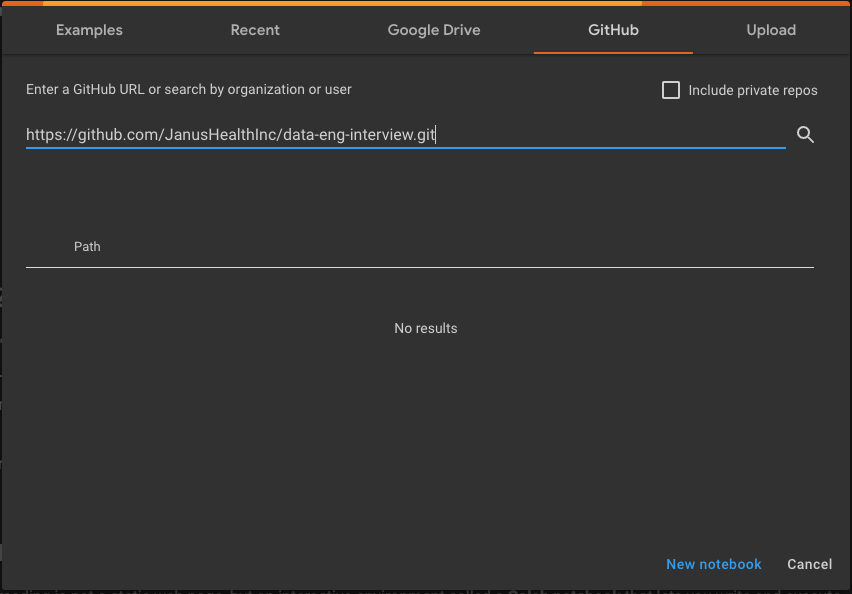

# data-eng-interview

1. Open [Google Colab](https://colab.research.google.com/) and create an account if you do not have one already
2. Go to File -> Open Notebook, then click on the GitHub tab and paste the following url to the URL line: `https://github.com/JanusHealthInc/data-eng-interview.git`. Click on the magnifying glass to search.

3. Select `JanusHealthInc/data-eng-interview` from the Repository dropdown & select `main` from the Branch dropdown
4. Choose `tech_assessment.ipynb` from the avilable notebooks (should be the only one there)
